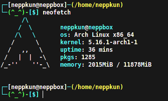
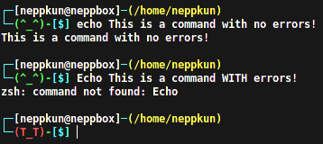

# My Dotfiles

+ Neofetch Config Preview

+ OMZ Theme Preview [ Using [oh-my-bash](https://ohmybash.nntoan.com/)? This theme is a port of [Kitsune](https://github.com/ohmybash/oh-my-bash/tree/master/themes/kitsune) ]

+ Polybar Preview

<h1 align="center">Setting up</h1>

### Neofetch

Using wget:

`wget https://raw.githubusercontent.com/Neppkun/dotfiles/main/neofetch.conf -O ~/.config/neofetch/config.conf`

Using curl:

`curl -o ~/.config/neofetch/config.conf https://raw.githubusercontent.com/Neppkun/dotfiles/main/neofetch.conf`

### OMZ Theme

Install the "zsh" package from your favorite package manager.

Install oh-my-zsh via:

curl:

`sh -c "$(curl -fsSL https://raw.github.com/ohmyzsh/ohmyzsh/master/tools/install.sh)"`

wget:

`sh -c "$(wget https://raw.github.com/ohmyzsh/ohmyzsh/master/tools/install.sh -O -)"`

Theme dependencies:

This theme requires you to have the "colors" plugin for oh-my-zsh, here's how to install:

`git clone https://github.com/zpm-zsh/colors ~/.oh-my-zsh/custom/plugins/colors`

`sudo nano ~/.zshrc`, search for "plugins". Find the line that says "plugins=(git)" and add "colors" after the "git".

Should say "plugins=(git colors)".

Install the theme:

Using wget:

`wget https://raw.githubusercontent.com/Neppkun/dotfiles/main/omz_theme.zsh-theme -O ~/.oh-my-zsh/themes/neppkunTheme.zsh-theme`

Using curl:

`curl -o ~/.oh-my-zsh/themes/neppkunTheme.zsh-theme https://raw.githubusercontent.com/Neppkun/dotfiles/main/omz_theme.zsh-theme`

Replace `ZSH_THEME=""` line in `~/.zshrc` (Usually line 11) with `ZSH_THEME="neppkunTheme"`

### Polybar

Install polybar from your favorite package manager.

Install the config:

Using wget:

`wget https://raw.githubusercontent.com/Neppkun/dotfiles/main/polybar -O <path to your polybar directory or wherever you want to keep this>`

Using curl:

`curl -o <path to your polybar directory or wherever you want to keep this> https://raw.githubusercontent.com/Neppkun/dotfiles/main/polybar`

Make a shell script in the same directory where you saved the config and put this in:

`polybar --config=~/HDD/polybar-themes/polybar bar &`

Run `sh <scriptFileName>.sh` from terminal to run polybar.

You can close the terminal after running it, however I suggest making it automatically execute on boot.

Using cron:

`crontab -e`

Add `@reboot sh <path to polybar script>` to the file and it ***SHOULD*** work.

# Contributions

Want to contribute? Make a pull request or join my [Discord Server](https://discord.gg/pTmX8Nu99Y)

# Credits

Thanks to [R2Boyo25](https://github.com/R2Boyo25) for fixing my broken OMZ theme.
