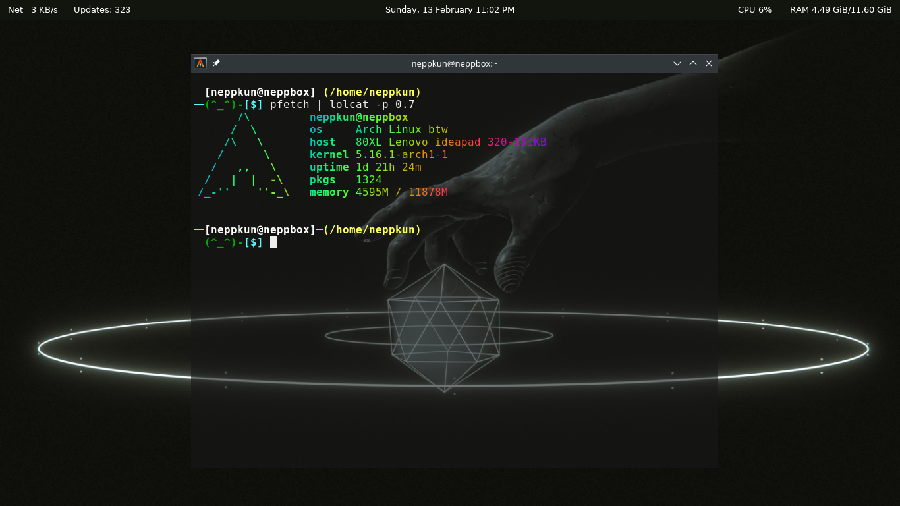

## My Dotfiles

+ Neofetch Config Preview

+ pfetch Config Preview

+ OMZ Theme Preview [ Using [oh-my-bash](https://ohmybash.nntoan.com/)? This theme is a port of [Kitsune](https://github.com/ohmybash/oh-my-bash/tree/master/themes/kitsune) ]

+ Allacritty Terminal Preview

+ Polybar Preview

<h1 align="center">Setting up</h1> 

## Neofetch

Install the "neofetch" package from your favorite package manager. 
( Skip this step if you already have neofetch installed )

### Installing the config:

Using wget:

`wget https://raw.githubusercontent.com/Neppkun/dotfiles/main/neofetch.conf -O ~/.config/neofetch/config.conf`

Using curl:

`curl -o ~/.config/neofetch/config.conf https://raw.githubusercontent.com/Neppkun/dotfiles/main/neofetch.conf`

## pfetch

Install pfetch: 
( Skip this step if you already have pfetch installed )
 
 
wget:

`wget https://raw.githubusercontent.com/dylanaraps/pfetch/master/pfetch -O /usr/bin/pfetch`

curl:

`wget https://raw.githubusercontent.com/dylanaraps/pfetch/master/pfetch -O /usr/bin/pfetch`

You can also install the "pfetch" package from AUR if you use Arch.  
### Installing the config:
 
I dont know how to make a magic command that'll automatically put the config where it's meant to, so you'll have to do this manually:
 
 
`sudo nano ~/.bashrc` if you use Bash or `sudo nano ~/.zshrc` if you use ZSH.

Add contents of the "pfetch.conf" file to the VERY bottom of the file.

Restart your shell or re-open your terminal for it to take effect.

## OMZ Theme
 
Install the "zsh" package from your favorite package manager. 
( Skip this step if you already have ZSH installed )
 
 

### Install oh-my-zsh via: 
( Skip this step if you already have oh-my-zsh installed )

curl:

`sh -c "$(curl -fsSL https://raw.github.com/ohmyzsh/ohmyzsh/master/tools/install.sh)"`

wget:

`sh -c "$(wget https://raw.github.com/ohmyzsh/ohmyzsh/master/tools/install.sh -O -)"`
 
 
### Theme dependencies:
 
This theme requires you to have the "colors" plugin for oh-my-zsh, here's how to install:

`git clone https://github.com/zpm-zsh/colors ~/.oh-my-zsh/custom/plugins/colors`

`sudo nano ~/.zshrc`, search for "plugins". Find the line that says "plugins=(git)" and add "colors" after the "git".

Should say "plugins=(git colors)".
  
### Install the theme:
 
Using wget:

`wget https://raw.githubusercontent.com/Neppkun/dotfiles/main/omz_theme.zsh-theme -O ~/.oh-my-zsh/themes/neppkunTheme.zsh-theme`

Using curl:

`curl -o ~/.oh-my-zsh/themes/neppkunTheme.zsh-theme https://raw.githubusercontent.com/Neppkun/dotfiles/main/omz_theme.zsh-theme`

Replace `ZSH_THEME=""` line in `~/.zshrc` (Usually line 11) with `ZSH_THEME="neppkunTheme"`

## Alacritty
 
Install the Alacritty terminal from your favorite package manager. 
Follow [This](https://github.com/alacritty/alacritty/blob/master/INSTALL.md) guide if your favorite package manager doesn't have Alacritty. 
(Skip this step if you already have Alacritty installed)
  
Alacritty checks for config files in these directories:

1. `$XDG_CONFIG_HOME/alacritty/alacritty.yml`
2. `$XDG_CONFIG_HOME/alacritty.yml`
3. `$HOME/.config/alacritty/alacritty.yml`
4. `$HOME/.alacritty.yml` 
If you already have a config file in one of these directories, you can chose to delete it or replace it with mine. I'm going to assume you DON'T have a config file for this.
  
### Install the config:
 
Using curl:

`curl -o $HOME/.config/alacritty/alacritty.yml https://raw.githubusercontent.com/Neppkun/dotfiles/main/alacritty.yml`

Using wget:

`wget https://raw.githubusercontent.com/Neppkun/dotfiles/main/alacritty.yml -O $HOME/.config/alacritty/alacritty.yml`

## Polybar
 
Install polybar from your favorite package manager. 
( Skip this step if you already have polybar installed )
  

### Install the config:
 

Using wget:

`wget https://raw.githubusercontent.com/Neppkun/dotfiles/main/polybar -O <path to your polybar directory or wherever you want to keep this>`

Using curl:

`curl -o <path to your polybar directory or wherever you want to keep this> https://raw.githubusercontent.com/Neppkun/dotfiles/main/polybar`
 
 
### Make a shell script in the same directory where you saved the config and put this in:

`pkill polybar && polybar --config=<path to polybar config> bar &`

Run `sh <scriptFileName>.sh` from terminal to run polybar.
 
 
You can close the terminal after running it, however I suggest making it automatically execute on boot.
 
### Using cron:

`crontab -e`

Add `@reboot sh <path to polybar script>` to the file and it ***SHOULD*** work.

 

## Contributions

Want to contribute? Make a pull request or join my [Discord Server](https://discord.gg/pTmX8Nu99Y)

## Credits

Thanks to [R2Boyo25](https://github.com/R2Boyo25) for finding a fix for my broken OMZ theme.

Thanks to [starmlerp](https://github.com/starmlerp) for pointing out my fucky wucky in the polybar config setup.