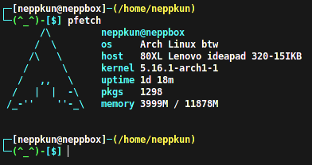

## My Dotfiles

+ Neofetch Config Preview

+ pfetch Config Preview

+ OMZ Theme Preview [ Using [oh-my-bash](https://ohmybash.nntoan.com/)? This theme is a port of [Kitsune](https://github.com/ohmybash/oh-my-bash/tree/master/themes/kitsune) ]

+ Polybar Preview

<h1 align="center">Setting up</h1>

## Installation

Each of the dotfiles can be automatically installed by running the following:

`$ make [DOTFILE]`

Where DOTFILE corresponds to the exact dotfile that you wish to install.

You can see the exact calls for each option by running:

`$ make list`

You can also install all of the dotfiles using:

`$ make all`

## Dependencies

[Neofetch](https://github.com/dylanaraps/neofetch)

[pfetch](https://github.com/dylanaraps/pfetch)

[oh-my-bash](https://ohmybash.nntoan.com/)

[Polybar](https://github.com/polybar/polybar)

## Contributions

Want to contribute? Make a pull request or join my [Discord Server](https://discord.gg/pTmX8Nu99Y)

## Credits

Thanks to [R2Boyo25](https://github.com/R2Boyo25) for fixing my broken OMZ theme.

Thanks to [starmlerp](https://github.com/starmlerp) for pointing out my fucky wucky in line 109.
